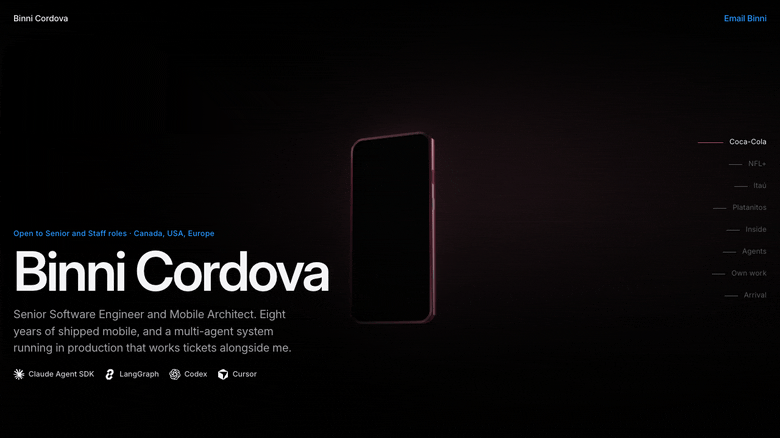

<h1 align="center">Binni Cordova</h1>

  <strong>Senior Software Engineer · Mobile Architect</strong> 
  React Native · Swift · Kotlin · Node · AWS · multi-agent systems in production

  Currently @ <strong>The Coca-Cola Company</strong> · open to Senior &amp; Staff roles in 🇨🇦 Canada · 🇺🇸 USA · 🇪🇺 Europe

  

  <a href="https://binnicordova.com"><strong>binnicordova.com</strong></a> 
  Eight years of shipped mobile as one continuous flight. Every screen in it is a real production recording.

  
  
  

---

### Agents work my stack now

At Coca-Cola I configured and operate a multi-agent system on **LangGraph** and the **Claude Agent SDK** that picks up front-end and back-end tickets and works them. Every change it makes is reviewed and signed off by me, as the accountable engineer.

| | |
|---|---|
| **Claude Code** | daily driver, front end and back end |
| **Claude Agent SDK · LangGraph** | multi-agent orchestration in production |
| **Codex CLI** | second opinion on diagnosis |
| **Cursor** | in-editor work |
| **TensorFlow Lite** | on-device inference |

Spec-driven development, AI-assisted diagnosis, prompt engineering — with eight years of shipping underneath it, which is what makes the review worth anything.

---

### Shipped

| Product | Role | Reach |
|---|---|---|
| **miMarket** — Coca-Cola | Senior Full Stack | B2B field sales, internal distribution |
| **[NFL+](https://apps.apple.com/us/app/nfl/id389781154)** | Senior Software Engineer | millions of viewers — mobile, web, CTV |
| **[Itaú](https://apps.apple.com/cl/app/itu-cuenta-corriente-digital/id1620586910)** | Software Engineer | 100K+ on a secure banking app |
| **[Platanitos](https://apps.apple.com/pe/app/platanitos/id1093153586)** | Full Stack | 1M+ downloads, one codebase to iOS, Android, Huawei |
| **Gruppo GPI** | Software Engineer | 3,000+ hospitals and clinics |

One React Native and TheoPlayer video player across phones, the web and smart TVs. Recoil retired for Jotai, native modules moved to Expo inside a Turborepo, bridge traffic cut until the thing started fast.

<strong>And thirteen more I build for myself</strong>

 

Ride hailing, vehicle records, a résumé scorer, a beach-safety guide, a React drill app, a live-event film maker, a personal-safety network, a live-stream AI assistant. Nights and weekends, shipped.

They are all on [binnicordova.com](https://binnicordova.com), in the last act.

---

### Stack

  

- **Mobile** — React Native, Expo, Swift, Kotlin, New Architecture (JSI · TurboModules · Fabric)
- **Architecture** — offline-first, backend-for-frontend, native modules, Keychain and Keystore, biometrics
- **Cloud** — AWS Lambda in Python, Firestore, Google Cloud, GraphQL, REST, WebSockets
- **Delivery** — Turborepo, GitHub Actions, Bitrise, Jenkins, Jest, Appium, Datadog, New Relic

---

<strong>How this profile's site is built</strong>

 

The GIF above is the real thing, not a mockup. [binnicordova.com](https://binnicordova.com) is one unbroken 3D world: an iPhone built entirely in CSS sits inside a scroll-driven camera and the reader flies through eight legs of it, in the order my résumé prints. At the peak the device body goes translucent and delaminates into the six planes it is actually made of, each labelled with the technology it really is — and the app keeps running through the whole move.

Every clip is a real production recording, cropped and scaled only. No pixel is altered anywhere in the pipeline.

It is verified rather than eyeballed: a harness walks the scroll track and asserts the copy never overshoots its cap, that no seam drops both legs at once, that the camera lerp converges without overshoot, and that a clip which cannot decode never takes the screen from the app's own frame. A second harness measures every line of copy against its worst frame on the composited page, using glyph rectangles rather than bounding boxes, and holds the whole page above 4.5:1.

Source is in this repository under `scrollcraft/builds/one-device/`.

---

### Reach me

  <a href="https://binnicordova.com"><strong>binnicordova.com</strong></a> ·
  <a href="https://www.linkedin.com/in/binnicordova">LinkedIn</a> ·
  <a href="mailto:binni.2000.cordova@gmail.com">binni.2000.cordova@gmail.com</a>

  Open to visa sponsorship and employer relocation.

