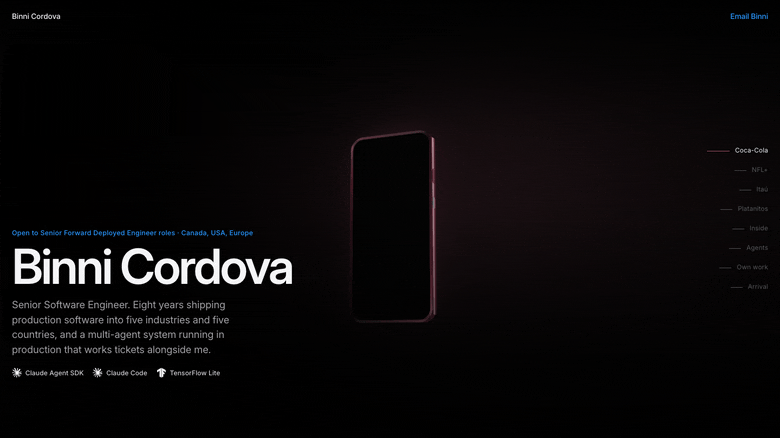

<h1 align="center">Binni Cordova</h1>

<p align="center">
  <strong>Senior Software Engineer</strong><br>
  Expo · React Native · TypeScript · AWS serverless · Swift · Kotlin · multi-agent systems in production
</p>

<p align="center">
  Previously @ <strong>The Coca-Cola Company</strong> (Apr 2025 – Sep 2026) · open to <strong>senior software engineering</strong> roles, Forward Deployed included<br>
  🇨🇦 Relocating to Vancouver, British Columbia, Canada
</p>

<p align="center">
  <a href="https://binnicordova.com">
    
  </a>
</p>

<p align="center">
  <a href="https://binnicordova.com"><strong>binnicordova.com</strong></a><br>
  <sub>Eight years of production software across five industries and five countries, as one continuous flight.<br>Every screen in it is a real production recording.</sub>
</p>

<p align="center">
  
  
  
  <a href="https://www.npmjs.com/~binnizenobiocordovaleandro"></a>
  
</p>

---

### What I do

- **8+ years of production software.** Expo, React Native, TypeScript and AWS serverless, with native Swift and Kotlin modules, across five industries (healthcare, e-commerce, banking, streaming media, consumer packaged goods), five countries and four languages.
- **Built for scale, and for the field.** 1,350,000+ orders a month for 1,500+ sellers on connections that drop; millions of NFL+ viewers on mobile, web and smart TVs; secure banking workflows for 100,000+ users.
- **I propose, then implement.** I bring designs for serverless AWS services and offline-first mobile clients, refine them with a software architect, and build them alongside product, design, QA and executives.
- **I ship on my own, and with AI.** 13 self-published apps taken through the App Store and Play Store publishing lifecycle, each built solo with AI in under 4 weeks, with releases automated through CI/CD and EAS over-the-air updates; 9 open-source npm packages; and a supervised multi-agent system (Claude Agent SDK) that resolved engineering tickets.

---

### Agents work my stack now

At Coca-Cola I configured and operated a multi-agent system (**Multica.ai** and **Paperclip.ing**) on the **Claude Agent SDK**, driven by spec-driven development, that picked up front-end and back-end tickets and worked them. Every change it made was reviewed and signed off by me, as the accountable engineer.

| | |
|---|---|
| **Claude Code** | daily driver, front end and back end |
| **Claude Sonnet 5.5 · Claude Opus 5.5 · OpenAI Terra** | the models I build with |
| **Claude Agent SDK** | multi-agent orchestration in production |
| **Multica.ai · Paperclip.ing** | agent orchestration for engineering tickets |
| **LangChain · LangGraph** | agent and LLM workflows |
| **TensorFlow Lite** | on-device inference |

Spec-driven development, AI-assisted diagnosis, prompt engineering — with eight years of shipping underneath it, which is what makes the review worth anything.

---

### Shipped

| Product | Role | Reach |
|---|---|---|
| **miMarket** — Coca-Cola | Senior Full-Stack · Apr 2025 – Sep 2026 | 1,500+ sellers across 5 South American markets, 1.35M+ orders/month, ES + PT + EN |
| **[NFL+](https://apps.apple.com/us/app/nfl/id389781154)** | Senior Software Engineer · Feb 2024 – Mar 2025 | millions of viewers — mobile, web, CTV — EN + ES + FR |
| **[Itaú](https://apps.apple.com/cl/app/itu-cuenta-corriente-digital/id1620586910)** | Software Engineer · Dec 2021 – Feb 2024 | 100K+ on a secure banking app, ES + PT, 90%+ automated coverage |
| **[Platanitos](https://apps.apple.com/pe/app/platanitos/id1093153586)** | Full-Stack · Mar 2019 – Dec 2021 | 1M+ downloads, multinational, one codebase to iOS, Android, Huawei |
| **[Gruppo GPI](https://www.gpigroup.com/)** | Software Engineer · Mar 2018 – Mar 2019 | 3,000+ hospitals and clinics across Europe |

miMarket is B2B field sales: 1,500+ sellers across Peru, Chile, Argentina, Paraguay and Brazil place more than 1,350,000 orders a month to Coca-Cola clients. I proposed and implemented the serverless microservices on AWS underneath it — Lambda behind API Gateway, with DynamoDB, S3, SNS and SQS — refining the designs with a software architect, and I rebuilt the React Native client offline-first on a SQLCipher encrypted SQLite database, maintaining the legacy version alongside the new offline one so the sellers' daily operation was never interrupted, across markets with different conditions and languages. Along the way I built Swift and Kotlin modules with Expo Modules and Turbo Modules, served as code reviewer and promoted engineering best practices. It runs in Spanish, Portuguese and English. Internal distribution only — it carries client records, so it ships to field devices under company control.

One React Native and TheoPlayer video player across phones, the web and smart TVs, shipped internationally in English, Spanish and French. Recoil retired for Jotai, native modules moved to Expo inside a monorepo, bridge traffic cut until the thing started fast.

---

### Native modules on npm

Everything above you have to take my word for. These you can install.

I write native iOS and Android modules for a living — biometrics, encrypted storage, hardware the JavaScript bridge cannot reach. The ones that are not somebody's private property, I publish, and I hold them to the same bar as the banking work they came out of.

#### [`react-native-check-biometric-changed`](https://www.npmjs.com/package/react-native-check-biometric-changed)

[](https://www.npmjs.com/package/react-native-check-biometric-changed)
[](https://www.npmjs.com/package/react-native-check-biometric-changed)
[](https://github.com/binnicordova/react-native-check-biometric-changed)

**Same device, different human.** A session granted to one face should not survive re-enrolment by another. This answers whether the biometric protecting a session is still the one enrolled when the session was granted — so the app can revoke it before a newly enrolled face or fingerprint inherits it.

Swift and Kotlin, straight out of the Itaú banking work. Zero runtime dependencies, autolinked, iOS 10+ and Android 23+. More than **1,900 downloads**.

```sh
npm install react-native-check-biometric-changed
```

#### Also published

| Package | | |
|---|---|---|
| [`expo-go-boilerplate`](https://www.npmjs.com/package/expo-go-boilerplate) | A starter for Expo and React Native apps with Expo Router, Jotai, Storybook, Jest, Biome, EAS builds and updates, and built-in AI agent skills. One codebase for iOS, Android, web and TV. | [](https://www.npmjs.com/package/expo-go-boilerplate) |
| [`expo-atoms`](https://www.npmjs.com/package/expo-atoms) | Atomic state management for Expo and React Native: primitive and derived atoms, no Provider required, no dependencies. Pure TypeScript; runs in Expo Go on iOS, Android and web. | [](https://www.npmjs.com/package/expo-atoms) |
| [`expo-feedback-ai`](https://www.npmjs.com/package/expo-feedback-ai) | An in-app feature-request board for Expo apps: users vote on ideas and an AI agent builds the most-voted. No backend, no API key, runs in Expo Go. | [](https://www.npmjs.com/package/expo-feedback-ai) |
| [`expo-orbs`](https://www.npmjs.com/package/expo-orbs) | Dotted thought-orb loading indicators for AI and agent UIs in Expo, with Jotai atomic state. Pure TypeScript for iOS, Android and web; runs in Expo Go and ships over EAS Update. Also published as `@binnicordova/expo-thinking-orbs`. | [](https://www.npmjs.com/package/expo-orbs) |
| [`expo-logs`](https://www.npmjs.com/package/expo-logs) | A file logger for Expo apps on iOS, Android and web, in pure TypeScript: rotating log files, console and error capture, and one-call sharing of logs so users can send diagnostics to support. Runs in Expo Go. | [](https://www.npmjs.com/package/expo-logs) |
| [`expo-useanimations`](https://www.npmjs.com/package/expo-useanimations) | 79 animated micro-interaction icons for Expo and React Native on iOS, Android and web. Works in Expo Go and with EAS Update; no native code. | [](https://www.npmjs.com/package/expo-useanimations) |
| [`iphone-duo-expo-rn`](https://www.npmjs.com/package/iphone-duo-expo-rn) | The iPhone "Duo" frosted-glass fold, driven by device motion. TypeScript only, no native code — iOS, Android and web. | [](https://www.npmjs.com/package/iphone-duo-expo-rn) |

All MIT, **1,600+ downloads in the last 30 days** across nine packages — [all of them on npm](https://www.npmjs.com/~binnizenobiocordovaleandro).

---

### Thirteen apps of my own

Designed, built and shipped on my own — each built with AI, from empty repository to a released product in **under four weeks**, through the full App Store and Play Store publishing lifecycle, with CI/CD and EAS over-the-air updates automating every release: ride hailing, vehicle records, a résumé scorer, a beach-safety guide, a React drill app, a live-event film maker, a personal-safety network, a live-stream AI assistant.

They are live on Google Play under **BinniCordova.com**, with 1,000+ installs a month — [see the full list](https://play.google.com/store/apps/developer?id=BinniCordova.com). They also fly past in the last act of [binnicordova.com](https://binnicordova.com).

---

### Also open to Forward Deployed roles

The work already looks like it. miMarket is not an app-store product: it carries client records, so it ships to company-controlled devices and runs in the field on more than 1,500 sellers' phones, in three languages. The offline-first rebuild, on an encrypted SQLCipher database, exists because of **where the software had to run**.

**Not yet done**, so you do not have to ask: my stakeholders have been internal (product, design, QA and executives), so I have no external pre-sales or consulting experience; and I have not worked on retrieval-augmented generation, vector databases or formal LLM evaluation harnesses.

---

### Stack

<p align="center">
  
</p>

- **Mobile** — Expo (managed and bare), React Native, Expo Modules, Turbo Modules, react-native-vision-camera with frame processors, offline-first, SQLCipher encrypted SQLite, native iOS and Android modules
- **Languages** — TypeScript, JavaScript, Swift, Kotlin, SQL
- **Cloud** — AWS serverless microservices, multi-account and multi-environment: Lambda, API Gateway (REST + GraphQL), DynamoDB, S3, SNS, SQS, Cognito, KMS, CloudWatch. Plus Google Cloud, Firestore, Firebase, WebSockets
- **AI** — Claude Code, Claude Sonnet 5.5, Claude Opus 5.5, OpenAI Terra, Claude Agent SDK, Multica.ai, Paperclip.ing, LangChain, LangGraph, spec-driven development, TensorFlow Lite
- **State** — Redux, Zustand, Jotai, Recoil
- **Delivery** — GitHub Actions, EAS Update (over-the-air releases), CI/CD, Bitrise, Jenkins, pnpm, App Store and Play Store publishing
- **Quality and security** — Jest, Appium, code review, Keychain and Keystore, biometrics
- **Open source** — npm package authoring and publishing, semantic versioning, autolinked iOS and Android modules, Expo Go compatible libraries

---

### Education and languages

- **Software Architecture Certificate** — TECSUP, Apr 2025 – Nov 2025
- **Bachelor's Degree in Computer Science** — Instituto Tecnológico Trentino Juan Pablo II, Mar 2013 – Dec 2015

🇪🇸 Spanish **native** · 🇬🇧 English **advanced** · 🇮🇹 Italian **fluent** · 🇫🇷 French **basic** · 🇩🇪 German **basic**

---

<details>
<summary><strong>How this profile's site is built</strong></summary>

<br>

The GIF above is the real thing, not a mockup. [binnicordova.com](https://binnicordova.com) is one unbroken 3D world: an iPhone built entirely in CSS sits inside a scroll-driven camera and the reader flies through eight legs of it, in the order my résumé prints. At the peak the device body goes translucent and delaminates into the six planes it is actually made of, each labelled with the technology it really is — and the app keeps running through the whole move.

Every clip is a real production recording, cropped and scaled only. No pixel is altered anywhere in the pipeline.

It is verified rather than eyeballed: a harness walks the scroll track and asserts the copy never overshoots its cap, that no seam drops both legs at once, that the camera lerp converges without overshoot, and that a clip which cannot decode never takes the screen from the app's own frame. A second harness measures every line of copy against its worst frame on the composited page, using glyph rectangles rather than bounding boxes, and holds the whole page above 4.5:1.

Source is in this repository under `scrollcraft/builds/one-device/`.

</details>

---

### Reach me

<p align="center">
  <a href="https://binnicordova.com"><strong>binnicordova.com</strong></a> ·
  <a href="https://www.npmjs.com/~binnizenobiocordovaleandro">npm</a> ·
  <a href="https://www.linkedin.com/in/binnicordova">LinkedIn</a>
</p>

<p align="center">
  <a href="tel:+16503744225"><strong>+1 650 374 4225</strong></a> ·
  <a href="mailto:binni.2000.cordova@gmail.com">binni.2000.cordova@gmail.com</a>
</p>

<p align="center">
  <sub>Relocating to Vancouver, British Columbia, Canada. Open to employer sponsorship.</sub>
</p>

<p align="center">
  <sub>Hiring into Canada runs through the <strong>Global Talent Stream</strong>, which the employer initiates:<br>
  software engineering is on the Category B in-demand list as <strong>NOC 21231</strong> and <strong>21232</strong>, and the stream targets two-week processing.</sub>
</p>
